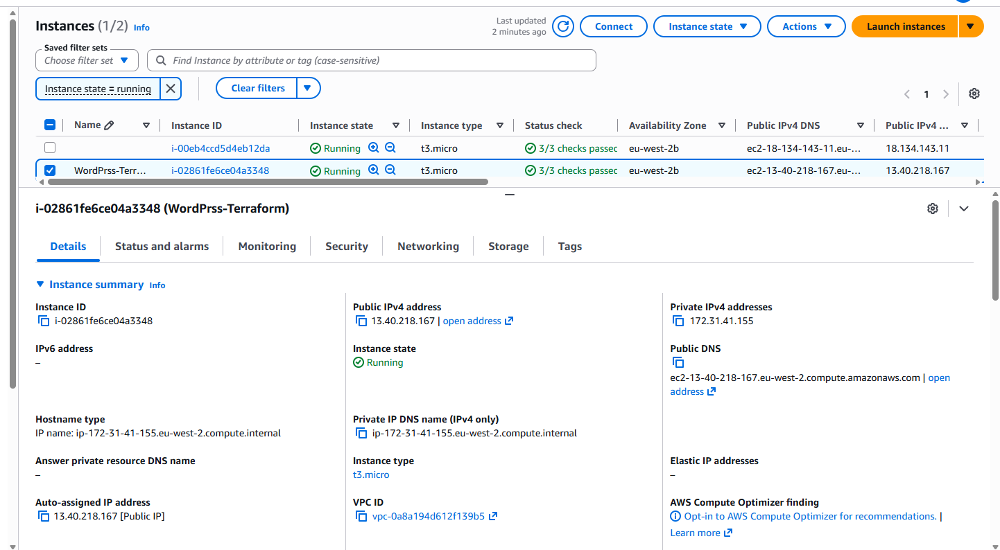
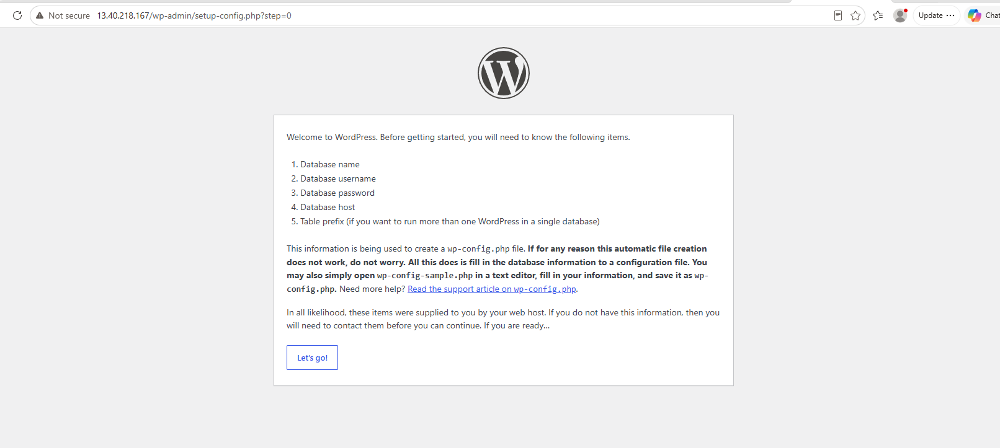
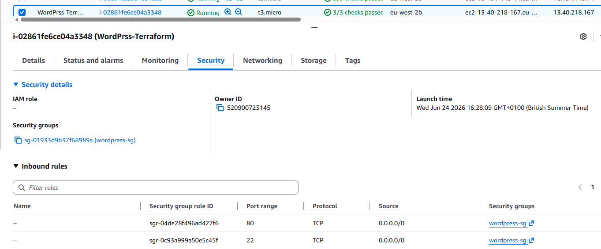

# WordPress Deployment Using Terraform

## Objective

This project uses Terraform to deploy a WordPress environment on AWS.

## Resources Created

* AWS EC2 Instance
* AWS Security Group
* User Data Script for automated software installation
* Public endpoint for WordPress access

## Files

* `provider.tf` - AWS provider configuration
* `main.tf` - EC2 instance and Security Group resources
* `variables.tf` - Input variables
* `outputs.tf` - Deployment outputs
* `user-data.sh` - Automated WordPress installation script

## Deployment Steps

1. Run `terraform init`
2. Run `terraform validate`
3. Run `terraform plan`
4. Run `terraform apply`

## Result

Terraform successfully deployed an EC2 instance running WordPress. The WordPress setup page was accessible through the public IP address generated during deployment.

